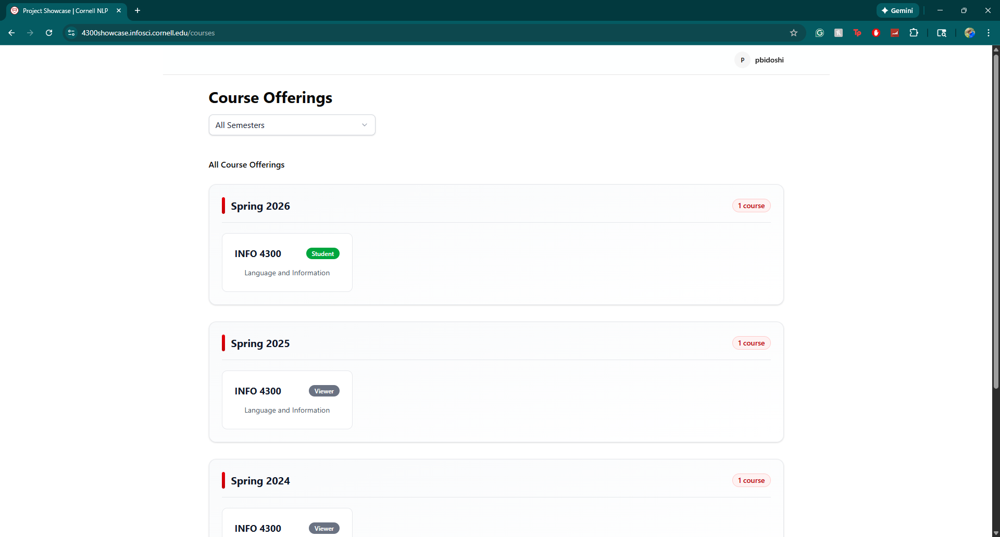
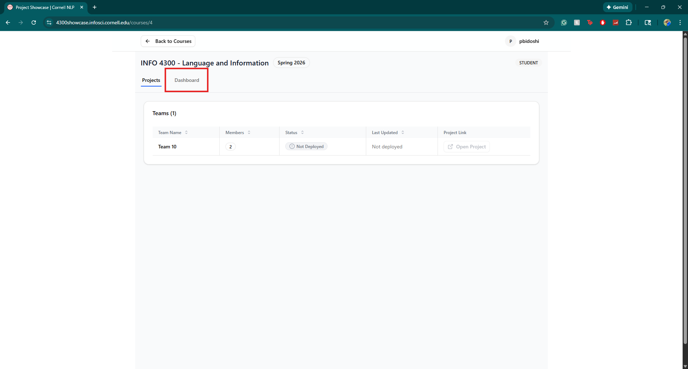
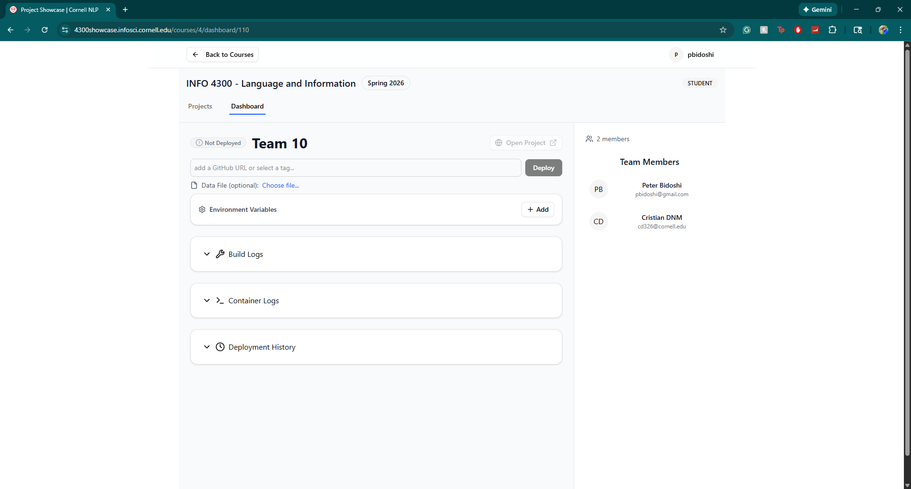

# 4300 Flask Template

## Contents

- [Summary](#summary)
- [Quick Start](#quick-start)
- [Architecture](#architecture)
- [Deploying on the Server](#deploying-on-the-server)
- [Running Locally](#running-locally)
- [Uploading Large Data Files](#uploading-large-data-files)
- [Troubleshooting Deployment Issues](#troubleshooting-deployment-issues)
- [Virtual Environments and Dependency Tracking](#virtual-environments-and-dependency-tracking)
- [Additional Resources](#additional-resources)
- [Feedback and Support](#feedback-and-support)

## Summary

This is a **Flask** template for **CS/INFO 4300 class at Cornell University**

This template provides:
- **Backend**: Flask with SQLite database and SQLAlchemy ORM
- **Frontend**: Server-rendered HTML templates with static assets

You will use this template to directly deploy your Flask code on the project server.

After you follow the steps below, you should have set up a public address dedicated to your team's project. For the moment, a template app will be running. In future milestones you will be updating the code to replace that template with your very own app.


## Quick Start

For the fastest way to get started with development:

### Windows
```bash
# 1. Set up Python virtual environment
python -m venv venv
venv\Scripts\activate

# 2. Install Python dependencies
pip install -r requirements.txt

# 3. Start Flask
python app.py
```

### Mac/Linux
```bash
# 1. Set up Python virtual environment
python3 -m venv venv
source venv/bin/activate

# 2. Install Python dependencies
pip install -r requirements.txt

# 3. Start Flask
python app.py
```

Then open `http://localhost:5001` in your browser!

## Architecture

This template uses a traditional Flask architecture:

### Application Structure
- **Location**: Root directory (`app.py`, `routes.py`, `models.py`)
- **Database**: SQLite with SQLAlchemy ORM
- **API Routes**: All API endpoints are prefixed with `/api` (e.g., `/api/episodes`)
- **Templates**: Server-rendered HTML in the `templates/` directory
- **Static Assets**: CSS, JavaScript, and images in the `static/` directory

## Deploying on the server 

For the initial deployment, only one member of your team needs to follow the steps below.

### Step 0: Fork this template

- **Fork** this repository on your GitHub account
- Make sure your repository is set to **PUBLIC** (required for deployment)
- Keep in mind that other students may be able to see your repository

### Step 1: Login to the deployment dashboard

- Login to the dashboard at https://4300showcase.infosci.cornell.edu/login using the Google account associated with your Cornell Email/NetID. Click the "INFO 4300: Language Information" **Spring 2026** course in the list of course offerings. You will have access to view the projects and code of previous years, as shown below.



### Step 2: Navigate to Your Team Dashboard

- You'll see a list of all teams in the course
- Find your team and click **"Dashboard"** to go to your team's deployment dashboard



### Step 3: Deploy Your Project

You'll see your team's dashboard that looks like this:



#### How to Deploy:

1. **Add Your GitHub URL**
   - In the text field at the top, paste the URL of your forked GitHub repository
   - Make sure your repository is PUBLIC

2. **Click the "Deploy" Button**
   - This will automatically:
     - Clone your code from GitHub
     - Build your Docker container
     - Start your Flask application
   - The first deployment may take 1-2 minutes

3. **Check Your Deployment Status**
   - Once deployed, the status will change from "Not Deployed" to show your deployment information
   - Click **"Open Project"** in the top right to visit your live app

4. **View Logs (if needed)**
   - Expand **"Build Logs"** to see what happened during the build process
   - Expand **"Container Logs"** to see runtime logs from your application
   - Expand **"Deployment History"** to see past deployments

#### Optional: Upload Data File
- If you have a custom JSON data file, click **"Choose file..."** under "Data File (optional)"
- This is meant for large files that may not be able to be tracked on github

#### Redeploying After Updates

When you push changes to GitHub and want to update your live app:
1. Simply click **"Deploy"** again
2. The system will pull your latest code and rebuild everything

That's it! Your Flask app should now be live and searchable.

## Running locally

This is to help you test and develop your app locally; we recommend each member of the team to try this out. 

### Prerequisites
- **Python 3.10 or above**: Required for Flask

### Setup and Run

1. Create a virtual environment:
   ```bash
   python -m venv venv
   ```
   (Use `python3` instead of `python` on Mac/Linux if needed)

2. Activate the virtual environment:
   - **Windows**: `venv\Scripts\activate`
   - **Mac/Linux**: `source venv/bin/activate`

3. Install Python dependencies:
   ```bash
   pip install -r requirements.txt
   ```

4. Run the Flask application:
   ```bash
   python app.py
   ```
   
   The app will run on `http://localhost:5001`. Open this in your browser to view the app.

### Modifying the Data

This project includes an `init.json` file with dummy episode data. You can modify and delete this file. You are allowed to create additional data files for your project.

## Troubleshooting Deployment Issues

### My app isn't loading after deployment
- Wait 30-60 seconds after deployment completes - larger apps need time to start up
- Try refreshing your browser page
- Click **"Open Project"** again from the dashboard

### How do I see what went wrong?
- Check **"Build Logs"** to see if there were errors during the build process
- Check **"Container Logs"** to see runtime errors from your running application
- Common issues:
  - Python dependency errors (check `requirements.txt`)
  - Database initialization errors (check your `init.json` format)

### Login/Authentication Issues
- If you get a 401 error, try logging out and logging back in
- Make sure you're using your Cornell email account

### Still Having Issues?
- Post on Ed Discussion with:
  - Your team name
  - What you tried
  - Screenshots of any error messages from the logs

## Virtual Environments and Dependency Tracking
- It's essential to avoid uploading your virtual environments, as they can significantly inflate the size of your project. Large repositories will lead to issues during cloning, especially when memory limits are crossed (Limit – 2GB). 
To prevent your virtual environment from being tracked and uploaded to GitHub, follow these steps:
1. **Exclude Virtual Environment**
   - Navigate to your project's root directory and locate the `.gitignore` file. 
   - Add the name of your virtual environment directory to this file in the following format: `<virtual_environment_name>/`. This step ensures that Git ignores the virtual environment folder during commits.

2. **Remove Previously Committed Virtual Environment**
   - If you've already committed your virtual environment to the repository, you can remove it from the remote repository by using Git commands to untrack and delete it. You will find resources online to do so.
Afterward, ensure to follow step 1 to prevent future tracking of virtual environment.

3. **Managing Dependencies**
    - Add all the new libraries you downloaded using pip install for your project to the existing `requirements.txt` file. To do so,
    - From your project root directory, run the command `pip freeze > requirements.txt`. This command will create or overwrite the `requirements.txt` file with a list of installed packages and their versions. 
    - Our server will use your project’s `requirements.txt` file to install all required packages, ensuring that your project runs seamlessly.

## Additional Resources

For a comprehensive list of common issues and solutions from previous semesters:

📋 **Known Issues Database**: https://docs.google.com/document/d/1sF2zsubii_SYJLfZN02UB9FvtH1iLmi9xd-X4wbpbo8

This document is continuously updated with solutions to problems students have encountered.

## Feedback and Support

- **Problems with deployment?** Post on Ed Discussion or email course staff
- **Feature requests for the dashboard?** Post on Ed
- **Questions about the deployment system?** Feel free to reach out - the course staff are happy to help!

